# ПРИЁМышь (PRIYOMysh) - десктопная социальная сеть

## Установка и запуск 
[Client setup instructions](https://github.com/M-M-duo/PRIYOMysh/tree/main/client/README.md)  
[Server setup instructions](https://github.com/M-M-duo/PRIYOMysh/tree/main/server/README.md)

## Функционал

- Регистрация и аутентификация
- Редактирование собственного профиля
- Создание постов (текст, теги, изображения)
- Ленты: свои посты, посты другого пользователя, новостная лента (публичные + подписчики), лента друзей (свои + взаимные подписки)
- Система подписок и подписчиков
- Лайки / дизлайки постов
- Поиск пользователей по логину
- Курсорная пагинация

## Архитектура проекта

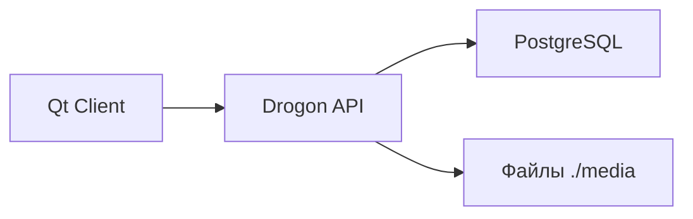

## Технологии

### Сервер (`/server`)

* **Язык:** C++17
* **Фреймворк:** Drogon Framework
* **База данных:** PostgreSQL 14+ (с использованием расширения `uuid-ossp`)
* **Безопасность:** Авторизация на базе JWT
* **Тестирование:** Drogon Test (unit-тесты) / PyTest (E2E API тесты)

### Клиент (`/client`)
Графическое приложение со строгим разделением логики.
* **Язык:** C++17
* **Фреймворк:** Qt6 (QtCore, QtGui, QtWidgets, QtNetwork, QImage)
* **Тестирование:** Ctest

## Скриншоты интерфейса

<!-- Вставьте реальные скриншоты, заменив пути -->
1. Вход / регистрация  
   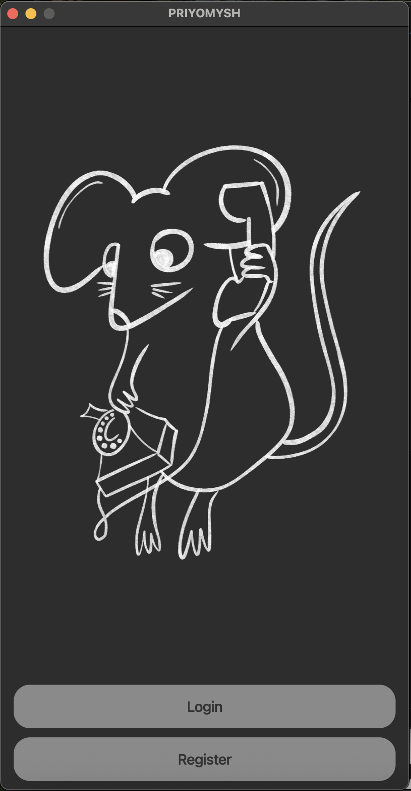 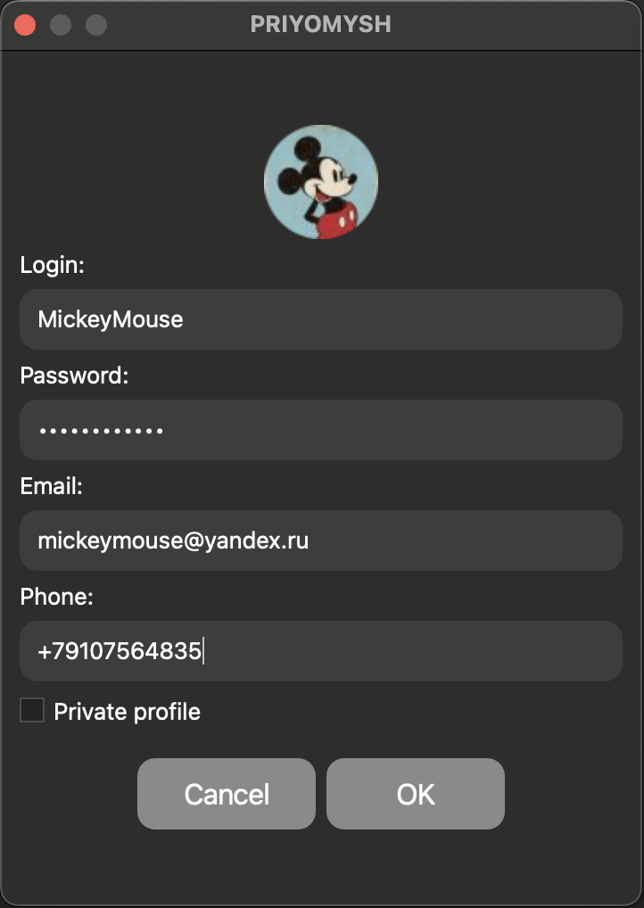 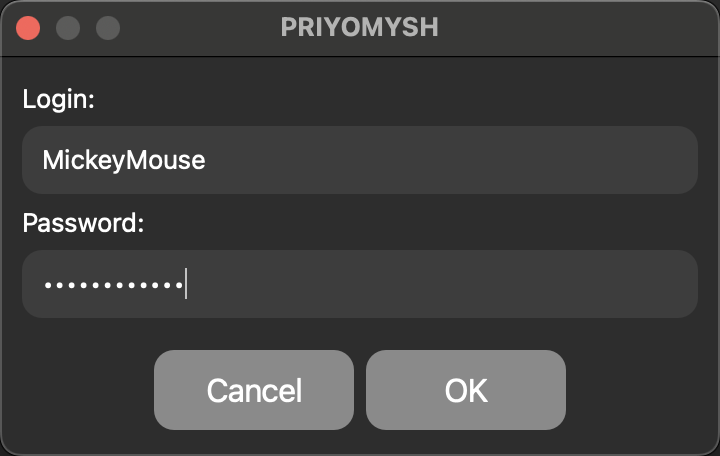
3. Лента  
   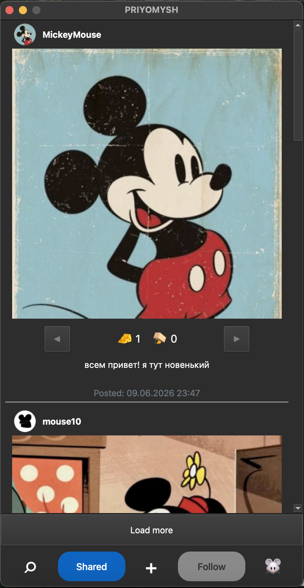 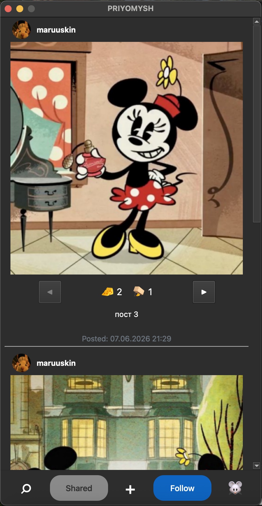
4. Создание поста  
   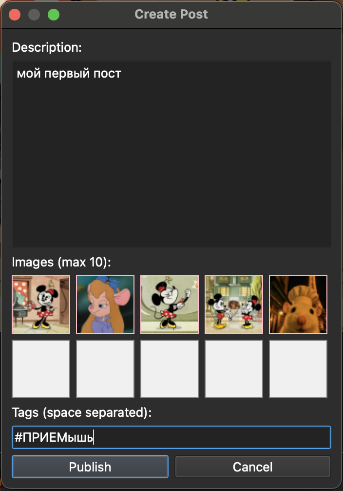
5. Профиль пользователя  
   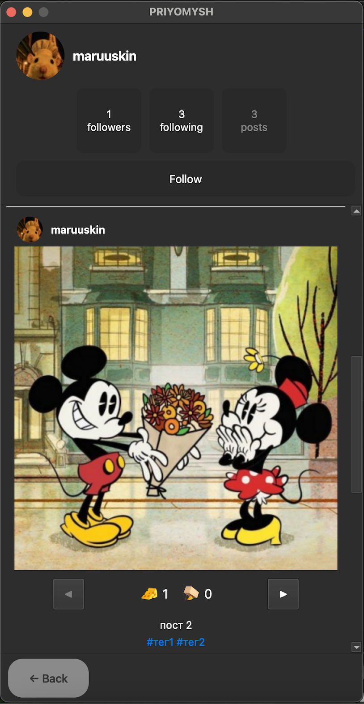 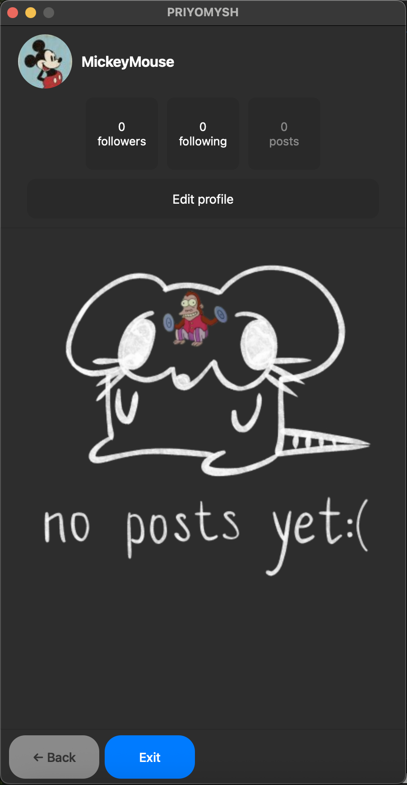
6. Редактирование профиля  
   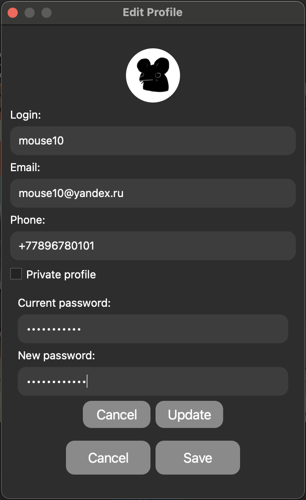
7. Друзья / подписчики  
   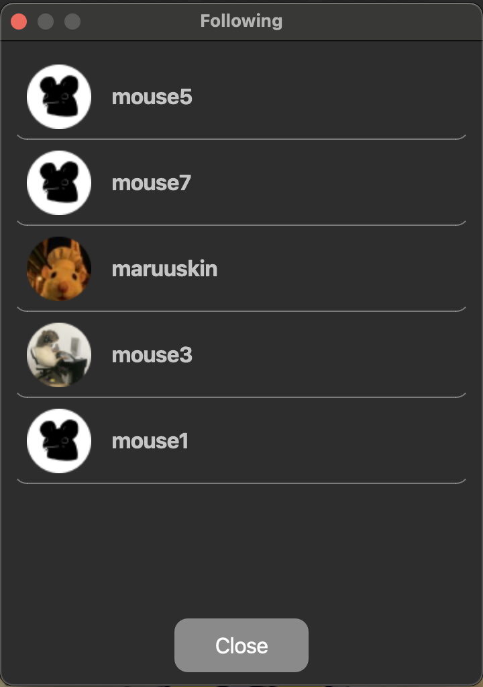
   
## Команда разработчиков:

* Вячеслав Возяков – клиент
* Мария Димитриева – сервер + БД
